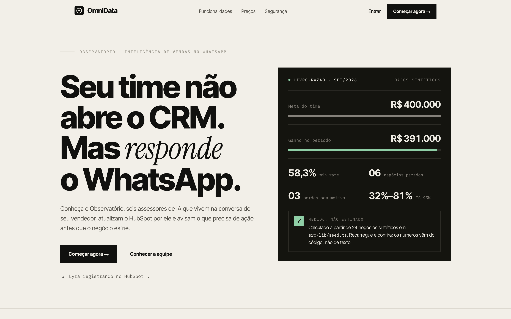

# OmniData

**Seu time não abre o CRM. Mas responde o WhatsApp.**

<p align="center"></p>

O OmniData leva a inteligência do HubSpot para o WhatsApp do vendedor. Quem cuida dele é o **Observatório**, uma equipe de sete assessores de IA
(Orion, Vega, Altair, Lyra, Aurora, Argus e Polaris): o Orion lê o pedido e divide o trabalho, e cada especialista responde assinando a própria parte.
Número na tela vem do SQL, nunca do modelo. É a primeira fatia de uma visão 360° do cliente.

**Demo do site:** https://omnidata-web-eta.vercel.app (dados sintéticos; login e cadastro são só demonstração).

<sub>Screenshot gerado por `scripts/screenshot-hero.sh` (Chrome headless sobre o build de produção). Os números do hero são calculados de dados sintéticos.</sub>

## Estado atual

| Peça | Estado |
|---|---|
| Front-end (landing, funcionalidades, preços, login, cadastro, dashboard) | Pronto, no ar na Vercel |
| Banco, migrations, views `gold`/`serving`, backup | Pronto e testado contra Postgres real |
| Ingestão do HubSpot (backfill retomável, incremental, histórico, snapshots, `audit`) | Pronto; **testado só com fixtures e HubSpot simulado** |
| Bot no WhatsApp (webhook, fila, orquestrador, escritas com recibo/Desfazer, alertas, resumo matinal) | Pronto; **testado só com simulação** |
| Observatório (Orion planeja, especialistas executam) | Pronto. Avaliação do planejador: conjunto de 68 frases + 17 inéditas (`omnidata eval planner`); **o modo com LLM ainda não foi medido** (precisa de chave) e faltam frases reais do WhatsApp |
| Áudios do WhatsApp (transcrição) | Pronto; **ainda não rodou na API real da OpenAI** |
| Upload de datasets (CSV/XLSX de negócios e metas): página, API e CLI | Pronto; testado com uma exportação real do HubSpot (1000 negócios) e no navegador |
| Airbyte como camada de conectores (HubSpot + outras fontes por mapeamento) | Pronto no código; **nunca rodou contra um Airbyte real** ([docs/airbyte.md](docs/airbyte.md)) |
| Insights de empresas (dores, termos, ERPs, tipo de demanda), com os agentes; painel `/dashboard/insights` | Pronto; testado com dataset sintético e com um export real do HubSpot (apenas na análise local); as views SQL (0009) ainda não rodaram contra o Postgres do bot em produção |
| Motivo de perda, previsão, coach (M2/M3), dbt | Não implementado (ADR 0002) |

Nada acima foi exercitado contra HubSpot, Meta ou LLM reais: veja **[docs/go-live.md](docs/go-live.md)** para o que depende das suas contas.

## O Observatório (harness agêntico, ADR 0003)

| Membro | Função | Ferramentas |
|---|---|---|
| **Orion** | Coordenador: analisa o pedido, monta o plano (≤ 3 passos) e devolve uma resposta só | — |
| **Vega** | Analista de Metas, segmentos e previsão | `get_kpis`, `get_quota_status`, `get_segment_insights`, `get_forecast` |
| **Altair** | Gerente de Pipeline, demanda e ERPs | `get_pipeline_summary`, `get_deal`, `list_deals_needing_action`, `get_demand_types`, `get_systems_landscape` |
| **Lyra** | Escriba do CRM e leitora de notas (dores, termos) | `add_note`, `create_task`, `propose_deal_update`, `undo_last`, `get_pains`, `get_recurring_terms` |
| **Aurora** | Rotina, alertas e insight do dia | `get_morning_brief`, `get_insight_digest` |
| **Argus** | Auditor de Confiança | `get_data_quality`, `get_insight_coverage` |
| **Polaris** | Coach de Qualidade: transforma a auditoria em fila de correção por vendedor (só lê; a Lyra grava) | `get_fix_queue` |

O LLM só *propõe* o plano; o código valida (allowlist por especialista, no máximo 1 escrita e por último). Endereçamento direto: “Vega, como estou na meta?”. `uv run omnidata team` lista a equipe; `team export` gera `web/src/lib/team.json` (um teste garante a sincronia).

**Áudios do WhatsApp:** transcritos com `gpt-transcribe` (OpenAI, US$ 0,0045/min; fallback `gpt-4o-mini-transcribe`), decodificados para WAV via ffmpeg, com limite de 180 s e orçamento diário por usuário. O bot mostra “Entendi: …” antes de responder, e escritas de risco continuam pedindo confirmação. Sem Azure no projeto (ADR 0004). Para escolher o modelo com seus áudios: `scripts/bench_transcribe.py`.

## Dados de entrada

- **Upload:** `/dashboard/datasets` (arrastar-e-soltar, prévia, relatório de erros por linha) ou `uv run omnidata dataset import arquivo.csv --kind deals --apply`. Reconhece a exportação do HubSpot em pt-BR, tira ganho/perdido da etapa e o motivo de perda das notas. Detalhes em [docs/datasets.md](docs/datasets.md).
- **Airbyte:** HubSpot e outras fontes aterrissam no Postgres e o OmniData mapeia para o `silver` (`INGEST_MODE=airbyte`). O cliente próprio do HubSpot continua sendo o padrão e o único que escreve no CRM. Guia em [docs/airbyte.md](docs/airbyte.md).

**Reunião de vendas** (`/dashboard/reuniao`): uma página para conduzir a reunião de vendas com o seu arquivo. Traz os KPIs, gráficos (pipeline e concentração, demanda, ERPs, dores e termos, lacunas de qualidade e cobertura) e **decisões sugeridas por regras fixas** (`web/src/lib/decisions.ts`): cada sugestão mostra a regra que a disparou, os números que a sustentam e o agente responsável, e vem rotulada como sugestão para não se confundir com número medido. Imprime em PDF pelo navegador. Tudo é calculado no navegador; não usa plataforma de BI nem modelo de linguagem. Um BI (por exemplo o Metabase, lendo `serving.*`) só faz sentido depois que a API e o Postgres estiverem no ar.

**Previsão (Vega, `get_forecast`; `omnidata forecast analyze <arquivo> --quota N`):** estimativa estatística de quanto o pipeline aberto ainda pode render e da chance de bater a meta. Usa a taxa de ganho dos negócios fechados (com intervalo de confiança de Wilson) em três cenários (baixo, central, alto) simulados com os mesmos números aleatórios, e mostra faixas (10% a 90%), nunca um número só. Recusa prever com menos de 10 fechados e marca como “teto, não previsão” quando os negócios abertos com valor são mais de 3 vezes os fechados, porque a taxa do passado não descreve um acúmulo de negócios parados. Determinística (semente fixa) e igual no bot e no navegador, com teste que executa o TypeScript no Node e compara com o Python. **O modelo de ML (scikit-learn) está desligado de propósito:** o projeto exige 300 fechados por pipeline e os exports não trazem data de criação nem histórico de etapa, então um modelo aprenderia o resultado em vez de prevê-lo (ADR 0007).

**Coach (Polaris):** `/dashboard/qualidade` mostra “O que corrigir” e, no WhatsApp, “o que preciso corrigir?” devolve os negócios com lacunas (sem valor, data vencida, sem próximo passo, sem nota, nome fora do padrão), ordenados por valor. Se uma lacuna aparece em quase todos os negócios (≥ 90%), ele avisa que pode ser do export ou do padrão do CRM, em vez de cobrar cada vendedor. Dono desativado e duplicatas vão só para o gestor. A Polaris não escreve no CRM: a correção passa pela Lyra, com confirmação. `omnidata hygiene analyze <arquivo>` roda sem banco.

**Insights de empresas** (`/dashboard/insights`, `omnidata insights analyze <arquivo>`): dores, termos recorrentes, ERPs/CRMs, tipo de demanda, segmentos e campanhas, extraídos das notas e dos nomes dos negócios por contagem determinística (sem LLM). Lyra cuida de dores e termos, Altair de demanda e ERPs, Vega de segmentos, Argus da cobertura e Aurora do insight do dia; o Orion junta tudo num pedido amplo. Cada bloco mostra a cobertura, e associações são correlação, nunca causa. Entende o export do HubSpot (`Cliente<>Parceiro [Demanda]`) e o formato `Empresa – Demanda`.

## Avaliação do planejador (Orion)

`uv run omnidata eval planner` mede se cada pedido vai para o especialista e a ferramenta certos, sem modelo-juiz: a resposta esperada é objetiva (agente + ferramenta), então a comparação é exata. O conjunto de frases fica em `src/omnidata/evals/planner_cases.yaml` (nomes de negócios do export real do HubSpot e alguns fictícios) e há um conjunto separado, `planner_holdout.yaml`, de frases que **nunca** foram usadas para ajustar as regras.

| Modo | Como rodar | O que mede |
|---|---|---|
| `keyword` (padrão) | `omnidata eval planner` | o roteamento sem LLM (modo degradado). Roda em qualquer lugar, sem chave |
| `llm` | `omnidata eval planner --mode llm` | o planejador de verdade (precisa de `LLM_PROVIDER` e chave no `.env`; gasta tokens) |

Cada caso termina em: **correct**, **acceptable** (cardápio no lugar de uma resposta, aceito para escritas e pedidos com vários passos, que só o LLM faz), **partial** (respondeu só parte de vários pedidos de leitura), **miss** (cardápio quando devia responder), **wrong** (respondeu outra coisa, pior que o cardápio) e **critical** (uma escrita no CRM que ninguém pediu; o comando sai com erro se houver alguma). Opções: `--json`, `--cases arquivo.yaml`, `--min-correct 0.8`.

**Modo `llm` (DeepSeek `deepseek-flash`, 20/09/2026):** primeira rodada com o prompt antigo (só nomes de ferramentas): 43% corretos no conjunto principal e 47% nas frases inéditas, sem nenhuma escrita indevida. O modelo acertava a ferramenta mas acrescentava passos de leitura desnecessários, chamava “bom dia” de fora de escopo e errava o argumento de `get_deal`. Depois de o prompt passar a trazer a descrição e os argumentos de cada ferramenta e a pedir o menor número de passos: **91% (62 de 68) no principal e 94% (16 de 17) nas inéditas, 0 escritas indevidas**. Ressalvas: são 17 frases inéditas escritas por mim (uma frase vale 6 pontos); rodada única (o modelo pode variar); e as inéditas não estão mais 100% virgens, porque a primeira rodada delas motivou a regra do “menor número de passos”. A confusão que sobra é entre “funil” e “negócios parados” (`get_pipeline_summary` × `list_deals_needing_action`).

Resultado em modo `keyword`: **85% corretos nas frases usadas para ajustar as regras** (isso só mostra que nada regrediu) e **24% nas 17 frases inéditas** (41% contando o cardápio como aceitável), sem nenhuma resposta errada nem escrita indevida. Ou seja, o modo sem LLM entende pouco fora do que foi previsto e cai no cardápio, que é o desenho; é por isso que a medida que importa é a do modo `llm`. Regra do conjunto inédito: não ajuste o roteador para fazê-lo passar; se precisar usar uma frase para corrigir algo, mova-a para o conjunto principal e escreva uma nova.

## Estrutura

```
web/                      Next.js 15 + Ledger (deploy: Vercel, Root Directory = web)
src/omnidata/
  agents/                 equipe (team.py) e validação de planos (orion.py)
  bot/                    orquestrador, ações de escrita, repositórios com Principal, gateway WhatsApp, webhook
  llm/                    chat (anthropic | openai), transcrição, guarda de números
  crm/hubspot/            cliente resiliente, mapeamento, escrita
  datasets/               upload: leitura CSV/XLSX, validação, importador
  integrations/airbyte/   cliente da API, aterrissagem HubSpot, mapeamento de outras fontes
  insights/               dores, termos, ERPs, demanda (determinístico; spec compartilhado com o web)
  ingest/  alerts/  api/  jobs/  security/
supabase/migrations/      SQL forward-only (bronze, silver, app, gold, serving)
docs/                     go-live.md, datasets.md, airbyte.md, templates.md, adr/ (0001–0006)
scripts/                  screenshot-hero.sh, bench_transcribe.py
```

## Começar (passo a passo)

Escolha o caminho pelo que você quer fazer. **Você não precisa de conta em HubSpot, Meta, OpenAI ou Anthropic para ver o produto funcionando.**

| Quero… | Caminho | Precisa de |
|---|---|---|
| Ver o site e o painel com dados sintéticos | [A](#a-só-o-site-e-o-painel-2-minutos) | Node 18.18+ |
| Analisar **o meu arquivo** (CSV/XLSX do CRM), sem servidor | [A](#a-só-o-site-e-o-painel-2-minutos), passo 3 | Node 18.18+ |
| Rodar o back-end, o banco e o bot (simulado) | [B](#b-back-end-com-banco-local) | Python 3.12, uv, Docker + Supabase CLI |
| Colocar no ar com HubSpot/WhatsApp reais | [docs/go-live.md](docs/go-live.md) | suas contas e chaves |

### A. Só o site e o painel (2 minutos)

```bash
git clone https://github.com/juliopessan/OmniData.git
cd OmniData/web
npm install
npm run dev          # http://localhost:3000
```

1. Abra `http://localhost:3000` e clique em **Entrar**. O login é só demonstração: qualquer e-mail válido e senha de 8+ caracteres funcionam.
2. No painel (`/dashboard`) você vê Visão geral, Negócios, Alertas, Equipe, WhatsApp e Qualidade dos dados, todos com dados sintéticos.
3. **Para usar o seu arquivo:** vá em **Datasets**, arraste o export de negócios do CRM no cartão **Negócios** (não no de Metas) e clique em **Carregar no painel**. Visão geral, Negócios, Qualidade e **Insights** passam a usar o seu arquivo. Para desfazer, use "remover".
   - **Privacidade:** nesse modo o arquivo é lido **só no seu navegador** e guardado no `localStorage` dele. Nada é enviado a servidor. Limpe o site nas configurações do navegador para apagar.
   - **Não coloque arquivos reais dentro do repositório** (principalmente em `web/public/`, que a Vercel publica). Use uma pasta `data/`, já ignorada pelo git.
   - As **Metas** só funcionam com o servidor (caminho B).
4. Modelos de planilha: no próprio cartão há o link "baixar CSV"; exemplos em `web/public/samples/` e `web/public/templates/`.

O que o arquivo de negócios precisa ter (nomes de colunas do HubSpot em pt-BR ou en, com ou sem acento):
`ID do registro`, `Nome do negócio`, `Etapa do negócio` (obrigatórias); `Valor`, `Data de fechamento`, `Proprietário do negócio`, `Associated Note` (as notas alimentam os Insights) e `Campanha…` (opcionais). Lista completa e regras em [docs/datasets.md](docs/datasets.md).

**Como ler os Insights:** cada bloco mostra a cobertura (quantos negócios têm dado para aquele bloco). Se as suas notas são de acompanhamento ("enviei proposta") e não descrevem a dor do cliente, o bloco Dores vem quase vazio; isso é limite do dado, não erro. Tipo de demanda e cliente saem do nome do negócio, nos formatos `Cliente<>Parceiro [Demanda]` ou `Empresa – Demanda`.

### B. Back-end com banco local

Pré-requisitos: Python 3.12, [uv](https://docs.astral.sh/uv/), [Docker](https://docs.docker.com/get-docker/) e a [Supabase CLI](https://supabase.com/docs/guides/cli) (fornecem o Postgres); `ffmpeg` só se for testar áudios.

```bash
git clone https://github.com/juliopessan/OmniData.git && cd OmniData
uv sync --extra dev                # instala as dependências
cp .env.example .env               # os valores padrão já apontam para o Postgres local; nunca commite o .env
supabase start                     # Postgres local em 127.0.0.1:54322 (Docker precisa estar rodando)
uv run omnidata db migrate         # cria os schemas bronze/silver/gold/serving/app
uv run omnidata dev seed           # CRM sintético, sem dados pessoais
uv run omnidata audit              # relatório de prontidão dos dados + go/no-go
uv run omnidata serve api          # http://localhost:8000  (/healthz, /readyz, webhook); porta ocupada? use --port 8010
uv run omnidata serve worker       # noutro terminal: fila de mensagens, ingestão e alertas
make check                         # ruff + mypy + pytest
```

**Sem chaves de LLM** (`ANTHROPIC_API_KEY` ou `OPENAI_API_KEY`), o bot funciona em modo degradado por palavras-chave e menu. Com chave, o Orion planeja com o modelo. Defina `LLM_PROVIDER=anthropic|openai` no `.env`. Não há Azure no projeto.

**Testes:** os que usam banco precisam de um Postgres de teste em `TEST_DATABASE_URL` (padrão `postgresql://postgres@127.0.0.1:54399/omnidata_test`); sem ele são ignorados, e o resultado mostra quantos foram. Para rodar todos, crie esse banco e aplique as migrations nele.

**Enviar um arquivo ao banco (em vez do navegador):**

```bash
uv run omnidata dataset template --kind deals > modelo.csv                # modelo de colunas
uv run omnidata dataset import negocios.csv --kind deals                  # só valida (precisa do banco)
uv run omnidata dataset import negocios.csv --kind deals --apply          # grava; reenviar o mesmo arquivo não duplica
uv run omnidata dataset import negocios.csv --kind deals --apply --allow-partial   # grava as linhas válidas e lista as recusadas
uv run omnidata dataset import metas.csv --kind quotas --apply
uv run omnidata insights analyze negocios.csv                             # insights em JSON, sem banco
```

**Usar a tela de Datasets contra a API:** no `.env` do back-end defina `ADMIN_API_TOKEN` (qualquer segredo longo; vazio desliga o upload) e `CORS_ORIGINS=http://localhost:3000`. Em `web/.env.local` crie `NEXT_PUBLIC_API_URL=http://localhost:8000`. Reinicie os dois e preencha URL e token na página Datasets; o token fica só na memória do navegador.

**HubSpot real:** `uv run omnidata audit properties && uv run omnidata ingest backfill` (precisa de `HUBSPOT_ACCESS_TOKEN`; os nomes de propriedades vêm da auditoria, nunca de suposição). Para usar o Airbyte como camada de conectores, veja [docs/airbyte.md](docs/airbyte.md). Em produção: `docker compose up` (api + worker) num host de containers, com o Postgres gerenciado (Supabase).

### Variáveis de ambiente principais

| Variável | Para quê | Obrigatória |
|---|---|---|
| `DATABASE_URL`, `DATABASE_URL_DIRECT` | Postgres | sim (caminho B) |
| `HUBSPOT_ACCESS_TOKEN` | leitura/escrita no HubSpot | só com HubSpot real |
| `WHATSAPP_*` | Meta Cloud API (token, app secret, verify token) | só com WhatsApp real |
| `LLM_PROVIDER`, `ANTHROPIC_API_KEY` / `OPENAI_API_KEY` | planejamento e narração; `OPENAI_API_KEY` também transcreve áudios | opcional (sem elas: modo degradado) |
| `ADMIN_API_TOKEN`, `CORS_ORIGINS` | upload de datasets pela API | só para usar a página Datasets contra a API |
| `INGEST_MODE` | `direct` (padrão) ou `airbyte` | não |
| `NEXT_PUBLIC_API_URL` (em `web/`) | liga o painel à API | não (sem ela o painel roda em modo demonstração) |

A lista completa, com comentários, está em `.env.example`.

### Deploy do site na Vercel

Importe o repositório com **Root Directory = `web`** (framework Next.js). Não exige variáveis de ambiente. `NEXT_PUBLIC_API_URL` só entra quando houver uma API hospedada: passo a passo em [docs/deploy-api.md](docs/deploy-api.md). Cada push em `main` publica sozinho.

## Problemas comuns

| Sintoma | Causa e solução |
|---|---|
| `Cannot find module './331.js'` ou página em branco no `npm run dev` | Cache do Next corrompido (por exemplo após rodar `next build` com o servidor aberto). `cd web && rm -rf .next && npm run dev`. |
| `cd: web: no such file or directory` | Você já está dentro de `web/`, ou fora do repositório. Use o caminho completo do clone. |
| Import pelo CLI falha com erro de conexão | O Postgres não está no ar: `supabase start` e confira `DATABASE_URL`. |
| Import recusado com `status: rejected` e "linha N · … data inválida" | O modo padrão é estrito: uma linha inválida recusa o arquivo. Corrija as linhas listadas ou use `--allow-partial` (CLI) / "importar as linhas válidas mesmo com erros" (tela). Num export real do HubSpot, poucas linhas vêm com a coluna Próxima atividade quebrada. |
| `{"detail":"Not Found"}` em `/healthz` ou `/api/datasets` | Outro programa está na porta 8000. Suba a API com `--port 8010` e ajuste `NEXT_PUBLIC_API_URL`. |
| Cartão Metas mostra "obrigatória: falta" para um export de negócios | Você soltou o arquivo no cartão errado; use o cartão **Negócios**. |
| Insights com muitos blocos vazios | Veja a cobertura no topo da página: o arquivo não traz notas, campanha ou motivo de perda. |
| "não consegue acessar a API" na página Datasets | `CORS_ORIGINS` não inclui a origem do site, ou a API não está no ar. |
| Testes de banco "skipped" | Sem Postgres de teste; veja **Testes** acima. |

## Rotas do site

| Rota | Conteúdo |
|---|---|
| `/` | Landing (Hook → Re-Hook → Meat → CTA) com números do time calculados de dados sintéticos |
| `/funcionalidades` | Blocos por tema com exemplos de conversa no WhatsApp |
| `/precos`, `/login`, `/cadastro` | Planos todos “Sob consulta”; login/cadastro **sem autenticação real** |
| `/dashboard/*` | Visão geral, negócios, alertas, **insights**, **reunião de vendas**, equipe, **datasets**, WhatsApp, qualidade dos dados |

Cada rota tem `<title>` próprio; o favicon é a mesma marca em todas (`web/src/app/**/icon.svg`). O efeito de verbos girando está em `web/src/components/SpinVerb.tsx`.

## Dados do site

`web/src/lib/seed.ts` (24 negócios sintéticos) → `web/src/lib/metrics.ts` (win rate, IC de Wilson, saúde do negócio, attention_score).
Todo número exibido é calculado ali; nada é digitado no JSX.
