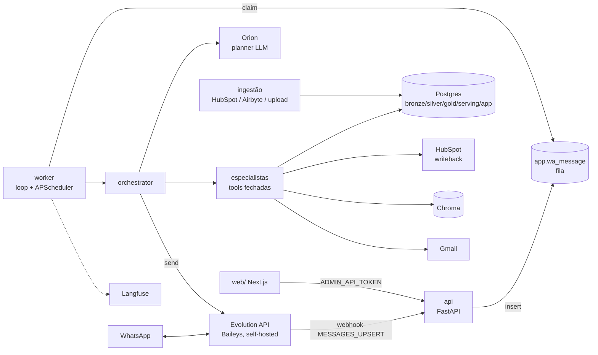
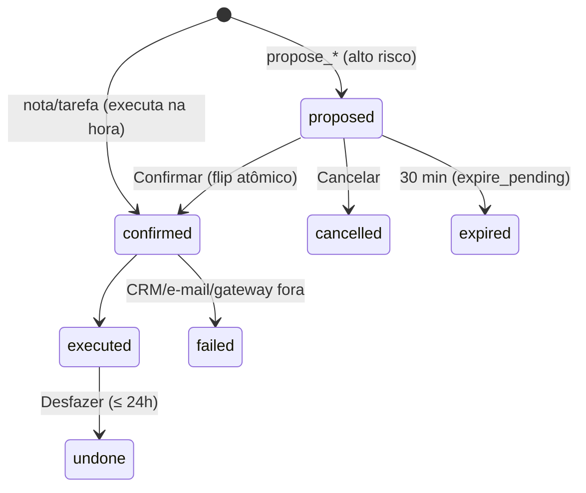

# OmniData — Especificação técnica do backend

Estado descrito: `main` em `9c502cd` (26/09/2026). Derivada do código, não de intenção: onde o código e um documento
antigo discordarem, vale o código. Serve de contrato para reaproveitar este backend em outra branch ou produto.
Complementa [SPEC-FRONTEND.md](SPEC-FRONTEND.md) (painel e site em `web/`).
Para montar para outro cliente: [REPLICACAO.md](REPLICACAO.md).

Convenções: `FR-*` são os requisitos do PRD citados no código; `ADR nnnn` são as decisões em `docs/adr/`; caminhos são
relativos a `src/omnidata/` salvo indicação.

---

## 1. O produto em uma página

Assistente de vendas no WhatsApp sobre um Postgres alimentado pelo CRM (HubSpot, upload de planilha ou Airbyte).
O vendedor pergunta em texto ou áudio; uma equipe de **10 agentes** (o "Observatório") responde com números calculados
em código, registra notas/tarefas no CRM com confirmação, monta propostas em PDF e manda alertas proativos.
Um painel web (Next.js, `web/`) mostra os mesmos dados para gestores.

Princípios que o código inteiro obedece (CLAUDE.md, "Rules"):

| # | Regra | Onde é garantida |
|---|---|---|
| 1 | O LLM propõe um plano; o código valida (allowlist por agente, ≤ 3 passos, ≤ 1 escrita e ela é a última) | `agents/orion.py::validate_plan` |
| 2 | O LLM nunca faz conta, nunca escreve SQL, nunca recebe PII crua | `security/pii_masking.py`, `llm/guard.py` |
| 3 | Todo número mostrado ao usuário vem do JSON de uma ferramenta | `llm/guard.py::numbers_ok` + template de fallback |
| 4 | Toda escrita passa por `app.pending_action` + `app.audit_log`, com chave de idempotência; escrita de alto risco pede confirmação | `bot/actions.py` |
| 5 | Texto voltado ao usuário do bot vive só em `bot/strings_ptbr.py` | revisão |
| 6 | Migrations são forward-only | `db.py::migrate` |
| 7 | Permissão é aplicada no repositório via `Principal`; nenhuma ferramenta aceita dono vindo do modelo | `security/principal.py`, `bot/tools/catalog.py::validate` |
| 8 | Autenticação e limite de tamanho rodam antes de ler o corpo HTTP | `api/guard.py` (ASGI puro) |
| 8b | Sem PII em logs, sem segredo no repositório | logs só com tipo de exceção e contagens |
| 10 | Mudar uma decisão exige ADR | `docs/adr/` |

---

## 2. Arquitetura

Dois processos, uma imagem Docker (`Dockerfile`, Python 3.12, `uv`):

| Processo | Comando | Faz |
|---|---|---|
| `api` | `omnidata serve api` (uvicorn, porta 8000) | recebe webhook, API de datasets e cockpit, health. **Não processa mensagem.** |
| `worker` | `omnidata serve worker` | consome a fila de mensagens, roda jobs agendados, envia alertas |

A separação é deliberada (D4/D6): o webhook grava e responde 200 rápido; todo trabalho acontece no worker.

### 2.1 Mapa de módulos

| Pacote | Responsabilidade |
|---|---|
| `config.py` | `Settings` (pydantic-settings, só variáveis de ambiente) e `hubspot_properties()` |
| `db.py` | conexão psycopg (sem prepared statements, seguro para pooler), `upsert`, `advisory_lock`, `migrate` |
| `api/` | `app.py` (fábrica FastAPI), `guard.py` (auth + limite de corpo), `datasets.py`, `cockpit.py` |
| `bot/` | `webhook.py`, `orchestrator.py`, `routing.py` (puro), `router.py` (palavras-chave), `actions.py` (escritas), `repo.py` (leituras com escopo), `gateway.py` (Protocol), `evolution.py`, `sentiment.py`, `strings_ptbr.py`, `tools/catalog.py` |
| `agents/` | `team.py` (equipe e allowlists: fonte de verdade), `orion.py` (prompt do planner + validação do plano) |
| `llm/` | `base.py` (interface), `anthropic.py`, `openai_chat.py` (OpenAI/DeepSeek/OpenRouter), `fallback.py`, `guard.py`, `prompts.py`, `transcribe.py` |
| `security/` | `principal.py` (identidade e escopo), `pii_masking.py` |
| `alerts/engine.py` | regras de alerta, envio com teto/horário de silêncio, resumo matinal, recap das 18h |
| `jobs/worker.py` | montagem das dependências (`build_*`) e agendamento |
| `crm/` | `base.py` (Protocol), `hubspot/client.py` (rate limit, paginação, busca), `mapping.py` (HubSpot → silver), `writeback.py` |
| `ingest/` | `jobs.py` (backfill/incremental/snapshot), `audit.py` (prontidão dos dados), `seed.py` (dados sintéticos), `backup.py` |
| `datasets/` | upload CSV/XLSX: `parse`, `spec` (aliases de cabeçalho), `validate`, `coerce`, `importer`, `templates` (ADR 0005) |
| `integrations/airbyte/` | `client.py` (API pública), `landing.py` (streams HubSpot → silver), `generic.py` (qualquer tabela → dataset canônico) (ADR 0006) |
| `insights/` | dores, termos, tipos de demanda, sistemas/ERPs, segmentos, motivos de perda: puro e determinístico |
| `hygiene/` | fila de correção de dados do CRM: puro |
| `forecast/` | previsão estatística do pipeline (Monte Carlo com semente fixa): puro (ADR 0007) |
| `rag/` | `embeddings.py` (OpenAI), `chroma.py` (índice semântico) (ADR 0009) |
| `transcripts/` | transcrições sintéticas sobre negócios reais e indexação no Chroma |
| `proposals/` | `template.py` (Jinja2), `pdf.py` (WeasyPrint), `templates/proposal.html` + fontes |
| `mailer/gmail.py` | `EmailSender`: Gmail API/OAuth2 (preferido) ou SMTP |
| `telemetry.py` | Langfuse opcional; sem chaves vira no-op |
| `evals/planner.py` | avaliação do roteamento contra um golden set |
| `metrics.py` | intervalo de Wilson |
| `cli.py` | CLI `omnidata` (Typer) |

Padrão de toda integração opcional: **degrada para desligada**. Cada `build_*` em `jobs/worker.py` devolve `None`
quando falta configuração, e o código chamador tem um caminho determinístico para esse caso (menu por palavras-chave,
template sem LLM, "e-mail indisponível", "não encontrei reuniões").

---

## 3. Modelo de dados (Postgres)

Cinco schemas em camadas (`supabase/migrations/0001..0014`, aplicadas por `omnidata db migrate`):

| Schema | Papel | Quem escreve |
|---|---|---|
| `bronze` | payload cru do HubSpot (`hubspot_raw`), expurgado após 30 dias | ingestão |
| `silver` | modelo normalizado do CRM | ingestão, upload, Airbyte, write-through das escritas |
| `gold` | métricas derivadas, **views SQL** (ADR 0002) | — |
| `serving` | **contrato estável de leitura** (views; só mudanças aditivas) | — |
| `app` | estado da aplicação | api/worker |

Todas as tabelas de `silver` e `app` têm `org_id uuid` (default `00000000-0000-0000-0000-000000000001`) e RLS habilitado
(migração 0005). Hoje é single-tenant; a coluna existe para a multi-tenancy futura.

### 3.1 `silver` (CRM normalizado)

| Tabela | Chave | Colunas relevantes |
|---|---|---|
| `owner` | `hs_owner_id` | email, first_name, last_name, is_active |
| `pipeline` | `hs_pipeline_id` | label |
| `stage` | (`hs_pipeline_id`, `hs_stage_id`) | label, display_order, is_closed, probability; `is_won`/`is_lost` gerados (fechado e prob. 1/0) |
| `deal` | `hs_deal_id` | name, amount, currency, pipeline/stage/owner, created_at, close_date, closed_at, is_open/is_won/is_lost, lost_reason_hs, source (campanha), last/next_activity_at, num_contacts, close_date_pushes, hs_updated_at, is_archived |
| `deal_stage_history` | (deal, stage, entered_at) | exited_at |
| `deal_property_change` | (deal, property, changed_at) | old_value, new_value |
| `deal_snapshot` | (snapshot_date, deal) | foto semanal: stage, amount, close_date, owner, is_open |
| `contact` | `hs_contact_id` | **email_hash** (nunca e-mail em claro), job_title, lifecycle_stage |
| `company` | `hs_company_id` | name, industry, employee_band |
| `deal_contact`, `deal_company` | associações | is_primary |
| `activity` | `hs_activity_id` | activity_type ∈ call/meeting/email/note/task, deal/contact/owner, occurred_at, due_at, is_completed, summary (texto da nota) |
| `quota` | (owner, period_start, period_end) | amount, source |

IDs vindos de upload levam o prefixo `up:` (`datasets/importer.py::ID_PREFIX`), para nunca colidir com IDs do HubSpot.

### 3.2 `gold` (views)

- **`stage_benchmarks`**: mediana e p75 de dias por etapa, a partir do histórico.
- **`deal_health`** (só negócios abertos e não arquivados): `days_in_stage`, `stage_p75_days` (p75 da etapa se n ≥ 30,
  senão 14), `is_stalled`, `days_since_activity`, `next_step_missing` (sem tarefa aberta nos próximos 7 dias nem
  reunião futura), `close_date_overdue`, `amount_change_pct_30d`, `health_flags[]` ∈
  {`stalled`, `no_next_step`, `close_date_overdue`, `gone_quiet` (≥ 10 dias sem atividade), `amount_swing` (> 20%)} e
  `attention_score = amount × stage_prob × min(1, 0.25 + 0.3·stalled + 0.25·overdue + 0.2·sem próximo passo)`.
- **`rep_period_metrics`** (por dono e mês): ganhos/perdidos, won_amount, win_rate com IC de Wilson 95%
  (`win_rate_ci_low/high`), `low_n` (n < 20), ticket médio, ciclo mediano, quota, `attainment`, `gap`,
  `open_amount_in_period`, `coverage`, `required_coverage = 1 / win_rate`.

### 3.3 `serving` (contrato de leitura)

Tudo que o bot e a web leem passa por aqui. **Uma branch nova deve consumir estas views, não `silver` direto.**

| View | Conteúdo |
|---|---|
| `v_deal_health` | `gold.deal_health` |
| `v_rep_kpis` | `gold.rep_period_metrics` |
| `v_coverage` | recorte de cobertura/gap |
| `v_owner` | donos |
| `v_deal_facts` | negócios não arquivados com campanha e motivo de perda (insights, forecast) |
| `v_deal_notes` | notas por negócio (insights) |
| `v_hygiene_facts` | campos para a fila de correção (valor, datas, dono ativo, nº de notas) |
| `v_meeting_transcript` | transcrições (Atlas) |
| `v_seller_goal` | metas pessoais |
| `v_activity` | atividades (recap das 18h) |
| `v_data_quality` | por dono: abertos, com próximo passo, perdidos 24m, perdidos com motivo |
| `v_agent_activity` | por agente e dia: passos, ok, falhas, p95 de latência |
| `v_alert_effectiveness` | por regra: enviados, vistos, agidos |
| `v_cost_per_user` | por usuário e mês: chamadas, tokens, custo |

### 3.4 `app` (estado da aplicação)

| Tabela | Uso |
|---|---|
| `app_user` | vendedor/gestor/admin: `hs_owner_id` (único), `phone_e164` (único), `role` ∈ rep/manager/admin, `manager_user_id`, `timezone`, `brief_time` (07:30), `status` ∈ invited/active/paused/revoked, consentimento (`consent_text_version`, `opted_in_at`) |
| `wa_message` | **fila de entrada e histórico de saída**: `direction`, `kind` (text/audio/interactive · text/buttons/list), `payload` jsonb (`text`; na saída também `options` = `[[reply_id, título], ...]` na ordem mostrada), `status` ∈ received/processing/done/failed/ignored, `attempts`, `error` |
| `conversation_state` | estado curto por usuário (`pick`, `adjust`, `edit`), expira em 30 min |
| `pending_action` | toda escrita: `kind`, `params`, `risk` ∈ normal/high, `status`, `idempotency_key` único, `before_state`/`after_state`, `undo_deadline` |
| `alert_event` | alerta por (usuário, `dedupe_key`) único: sent/viewed/acted/snoozed |
| `audit_log` | trilha de eventos (escritas, `llm_down`, `number_guard_fallback`, `morning_brief_sent`, `evening_recap_sent`, `opt_in`, `send_proposal`...) |
| `llm_call` | uso e custo por chamada (planner, narrator, transcribe) |
| `agent_step` | um registro por passo executado do plano (agente, tool, status ok/empty/failed/rejected, latência) |
| `seller_goal` | meta pessoal: `goal_type` ∈ deals_won/quota_pct, target, deadline, status |
| `meeting_transcript` | fonte de verdade das transcrições (Chroma é só índice) |
| `dataset_upload` | histórico de uploads: sha256, status, contagens, erros, resumo |
| `loss_reason`, `model_run` | captura de motivo de perda; registro de modelos (camada ML, ainda não usada) |
| `ingest_window`, `ingest_cursor` | backfill retomável por janela; high-watermark do incremental |

---

## 4. Identidade e permissão

`security/principal.py::resolve_by_phone` transforma o telefone do remetente em um `Principal`. **Só usuários
`active` resolvem**; desconhecido, convidado, pausado e revogado não recebem dado nenhum.

| Papel | `owner_ids` (o que enxerga) |
|---|---|
| `rep` | só o próprio `hs_owner_id` |
| `manager` | o próprio + os usuários ativos com `manager_user_id` = ele |
| `admin` | `None` = todos |

Toda consulta de `bot/repo.py` aplica `Principal.owner_clause()` (`hs_owner_id = any(%s)`). O catálogo remove
`owner`, `owner_id`, `user`, `user_id` e `hs_owner_id` dos argumentos que vierem do modelo antes de validar.

Onboarding (FR-BOT-1): `omnidata user invite` cria o usuário como `invited` e envia o texto de consentimento; a
resposta "Aceito" ativa e grava `consent_text_version` + `opted_in_at`. `omnidata user erase` apaga o usuário e
tudo ligado a ele (LGPD).

PII: `mask_pii` troca CNPJ, CPF, e-mail e telefone por marcadores antes de qualquer texto ir para um LLM, para o
Chroma ou para o Langfuse.

---

## 5. Ciclo de vida de uma mensagem

1. **Webhook** `POST /webhooks/evolution`: checa `X-OmniData-Secret` em tempo constante; o `BodyGuardMiddleware` já
   recusou corpos acima de `WEBHOOK_MAX_BYTES`. Só `messages.upsert`; ignora `fromMe` (eco do próprio bot) e grupos
   (`@g.us`). Tipos aceitos: `conversation`/`extendedTextMessage` → text, `audioMessage` → audio,
   `buttonsResponseMessage`/`listResponseMessage` → interactive. Grava em `app.wa_message` com
   `on conflict (wa_message_id) do nothing` (entrega duplicada é ignorada). Responde 200.
2. **Worker** `process_next`: reivindica a próxima mensagem `received`, chama `handle`, marca `done`, ou volta para
   `received` em erro (vira `failed` na 3ª tentativa). `requeue_stuck` (a cada 5 min) devolve mensagens presas em
   `processing` há mais de 2 min.
3. **`handle`**: resolve o `Principal` (senão onboarding ou recusa) → rate limit (`RATE_LIMIT_MSGS_PER_HOUR`, por
   telefone) → agradecimento seco ("valeu", 👍...) vira **reação 👍** em vez de resposta → áudio é transcrito (e a
   resposta começa com "🎤 Entendi: ...") → `_handle_text` ou `_handle_reply_id`.
4. **`_handle_text`**, nesta ordem:
   1. `_numbered_option`: se a última mensagem enviada (≤ 30 min) tinha opções e o texto é um número ou o título de
      uma opção, vira o `reply_id` correspondente. Necessário porque a Evolution mostra botões/listas como texto
      numerado.
   2. Confirmação por texto livre ("pode", "confirmo", "sim" / "cancela", "não") age sobre a `pending_action`
      `proposed` mais recente.
   3. Estados curtos: `adjust` (novo valor de um update), `edit` (editar nota recém-registrada).
   4. `_orion` (roteamento).
5. **Envio** `send`: pulsos opcionais de "digitando..." (`TYPING_DELAY_MAX_SECONDS`), depois `send_list` /
   `send_buttons` (máx. 3) / `send_text`; grava a saída em `wa_message` com as `options`.

### 5.1 Roteamento (`_orion`)

1. `pre_route` (sem LLM): apelido ("me chama de X"), endereçamento direto ("Vela, ..." força o especialista),
   apresentação de um agente, pergunta sobre a equipe (`TEAM_Q`: equipe, especialistas, quem são vocês...).
2. **Planner LLM**, se houver LLM e o usuário estiver abaixo de `USER_DAILY_TOKEN_BUDGET`: recebe o texto mascarado,
   precedido da **última troca completa** ("Contexto da última troca", uma só, para resolver "isso"/"essas causas"),
   e chama a ferramenta `plan`. `interpret_llm` devolve:
   - `plan` → `validate_plan` aprova ou rejeita (plano rejeitado nunca executa);
   - `FORA_DO_ESCOPO` → só vale se a rede de palavras-chave também não achar nada;
   - `PRECISA_MAIS:<agente>` → resposta `NEEDS_INFO` com dica específica do agente (`S.NEEDS_INFO_DETAIL`).
3. **Rede determinística** (`keyword_decision`, também o modo degradado sem LLM, FR-BOT-7): regex em
   `bot/router.py` → um especialista; visão geral de insights → plano fixo de 3 leituras; pedido de escrita sem LLM →
   menu (nunca responde só a metade de leitura).
4. `run_plan`: executa os passos em sequência, registra `agent_step`, assina cada trecho com o nome do agente (sem
   repetir quando dois passos seguidos são do mesmo), para no primeiro passo que pede escolha (lista), e junta tudo
   numa resposta só.

### 5.2 Narração e trava de números

Leituras devolvem `(json, template)`. `_narrate` manda **só o JSON** ao narrador (`llm/prompts.py::NARRATOR_SYSTEM` +
persona do agente + ajuste de tom por `sentiment.classify`: frustrado → direto; com pressa → sem introdução). O texto só
é usado se tiver ≤ 600 caracteres e **todo número nele existir no JSON** (`numbers_ok`, aceitando arredondamento de
0–2 casas e a forma percentual de frações). Senão, usa o template determinístico de `strings_ptbr.py` e registra
`number_guard_fallback`. Sem LLM ou acima do orçamento: template direto.

---

## 6. O Observatório (agentes e ferramentas)

Fonte de verdade: `agents/team.py` (exportado para a web com `omnidata team export > web/src/lib/team.json`; um
teste mantém os dois iguais). Argumentos: `bot/tools/catalog.py` (pydantic; argumento inválido = menu).

| Agente | Papel | Ferramentas (argumentos) |
|---|---|---|
| **Orion** | coordenador: planeja, não executa | — |
| **Vega** | metas, KPIs, segmentos, previsão, status do time | `get_kpis(period)`, `get_quota_status(period)`, `get_segment_insights(dimension, limit)`, `get_forecast()`, `get_team_status(period)` |
| **Altair** | pipeline, negócio, demanda, ERPs | `get_pipeline_summary()`, `get_deal(query)`, `list_deals_needing_action(limit)`, `get_demand_types(limit)`, `get_systems_landscape(category, limit)` |
| **Lyra** | escriba do CRM, dores e termos | `add_note(deal, text)`, `create_task(deal, title, due_in_days)`, `propose_deal_update(deal, field, value)`, `undo_last()`, `get_pains(limit)`, `get_recurring_terms(limit)` |
| **Aurora** | rotina, insight do dia, meta pessoal | `get_morning_brief()`, `get_insight_digest()`, `set_goal(goal_type, target, deadline_in_days)`, `get_goal_status()` |
| **Argus** | auditor de confiança | `get_data_quality()`, `get_insight_coverage()` |
| **Polaris** | coach de qualidade de dados (só lê) | `get_fix_queue(limit)` |
| **Nova** | coach de vendas | `get_playbook(topic, limit)`, `search_meeting_notes(query, deal, limit)` |
| **Atlas** | memória de reuniões | `search_meeting_notes(query, deal, limit)` |
| **Vela** | propostas em PDF | `send_proposal(deal, summary?, channel, recipient_email?)` |

Valores fechados: `period` ∈ this_month/last_month · `dimension` ∈ segment/campaign/loss_reason · `category` ∈
erp/crm/all · `topic` ∈ objection/pitch/pain · `field` ∈ stage/close_date/amount · `goal_type` ∈ deals_won/quota_pct
· `channel` ∈ email/whatsapp/both. Limites numéricos estão no catálogo (ex. `limit` 1–10, `deadline_in_days` 1–90).

`search_meeting_notes` tem dois donos legítimos (Nova e Atlas); a resposta é assinada por quem o Orion planejou.

**Escritas** (`WRITE_TOOLS`): `add_note`, `create_task`, `propose_deal_update`, `undo_last`, `set_goal`,
`send_proposal`. O planner vê, por ferramenta, os argumentos obrigatórios e os valores literais de cada enum
(`orion._tool_line`); o `plan` em si só restringe `agent`/`tool`.

Sugestões proativas são determinísticas e condicionadas a dado real: `tpl_attention`/`tpl_brief` sugerem a Polaris
quando há item na fila de correção; `tpl_playbook` sugere a Lyra; `tpl_brief` cumprimenta pela hora local.

---

## 7. Escritas

### 7.1 Máquina de estados de `pending_action`

- O flip `proposed → confirmed` é um único `UPDATE ... WHERE status='proposed' AND expires_at > now() RETURNING`:
  confirmar duas vezes executa uma vez (`ALREADY_DONE`).
- `idempotency_key = "<user_id>:<action_id>"`.
- `PENDING_TTL` = 30 min · `UNDO_WINDOW` = 24 h.

### 7.2 Por tipo

| Escrita | Risco | Fluxo |
|---|---|---|
| `add_note`, `create_task` | normal | executa na hora no HubSpot; recibo com **Editar** / **Desfazer** (24h); desfazer arquiva no HubSpot e apaga de `silver.activity` |
| `propose_deal_update` (etapa, data, valor) | alto | coerção (`_coerce`: valor em pt-BR, data AAAA-MM-DD, etapa pelo rótulo dentro do pipeline do negócio) → **Confirmar / Ajustar / Cancelar** → `update_deal` + write-through em `silver.deal` → **Desfazer** com checagem otimista: só reverte se o CRM ainda tiver o valor escrito por nós (`UNDO_STALE` caso contrário) |
| `set_goal` | local | grava `app.seller_goal` direto (substitui a meta ativa), sem HubSpot |
| `send_proposal`, `channel="whatsapp"` | normal | PDF volta só para o próprio vendedor: gera e envia na hora (`send_proposal_to_self`) |
| `send_proposal`, `email`/`both` | alto | sai para o cliente: **Confirmar / Cancelar** → `confirm_send_proposal`; sem Desfazer |

Resolução do negócio (`repo.find_deals` + `_run_write`/`_resolve_deal`): busca por tokens dentro do escopo do
`Principal`; ignora valor e parênteses colados ("(R$ 120.000)"); número casa como palavra inteira ("890" não acha
"1890"); nome exato vence; mais de um candidato → lista para escolher (estado `pick` lembra a intenção).

Sem `HUBSPOT_ACCESS_TOKEN`, escritas no CRM respondem `HUBSPOT_DOWN`; `set_goal` e `send_proposal` rodam antes desse
portão porque não tocam o HubSpot.

### 7.3 Vela — propostas

- Dados: nome, valor e dono vêm do CRM; `summary` (escopo) é texto livre opcional. Sem escopo, o PDF traz um
  parágrafo neutro ("Proposta comercial para X, referente a Y...") e a resposta avisa que saiu só com os dados do CRM.
  Nenhum item é inventado.
- O cliente nunca vê o rótulo cru do CRM: `client_name()`/`scope_front()` reaproveitam os parsers de
  `insights/compute.py` ("Uniconte [Tax Partner_Licenciamento]" → cliente "Uniconte", frente "Tax Partner Licenciamento").
- Nº da proposta = 8 primeiros hex do id da `pending_action` (mesma referência do `audit_log`). Validade: 15 dias.
- PDF: Jinja2 sobre `proposals/templates/proposal.html` (layout com tabelas; o WeasyPrint 62.x tem suporte parcial a
  flexbox e a `<section>`), fontes OFL embutidas (Inter Tight, IBM Plex Mono, Instrument Serif), cabeçalho/rodapé com
  `@page` e paginação. `PROPOSAL_COMPANY_NAME` assina; `PROPOSAL_LOGO` (arquivo) vira data URI, senão monograma.
- Entrega: e-mail via `EmailSender` (anexo PDF) e/ou `send_document` no WhatsApp.

---

## 8. Jobs agendados (worker)

`jobs/worker.py`, APScheduler no fuso `APP_TIMEZONE`, cada job protegido por advisory lock do Postgres (uma execução
por vez mesmo com mais de um worker):

| Job | Frequência | Lock | Faz |
|---|---|---|---|
| `ingest_and_alert` | 15 min (roda no start) | 7002 | incremental (HubSpot direto ou Airbyte) → `engine.evaluate` → `engine.dispatch` |
| `briefs` | 5 min | 7003 | resumo matinal no `brief_time` de cada usuário, dias úteis, 1× por dia (dedupe via `audit_log`) |
| `recap` | 5 min | 7006 | recap a partir das 18h local, dias úteis, 1× por dia: ganhos do dia, notas registradas, 3 negócios para amanhã |
| `housekeeping` | 5 min | 7004 | expira pendências, reenfileira mensagens presas, expurga bronze > 30 dias, `wa_message` > 90 dias, `llm_call` > 180 dias |
| `snapshot` | segunda 02:00 | 7005 | `silver.deal_snapshot` semanal |
| `nightly_backup` | 03:00 | — | `pg_dump` das tabelas insubstituíveis (`deal_snapshot`, `deal_property_change`, `app.*`) |

Falha de job é logada (só o tipo da exceção) e nunca derruba o worker. Gateway fora do ar (ex. WhatsApp desconectado)
aparece como `skip job <lock>: evolution 400 ... Connection Closed` e se resolve sozinho quando a instância volta.

### 8.1 Alertas (FR-ALR-1..3)

Regras sobre `serving.v_deal_health.health_flags`, com `dedupe_key` estável (reexecução é idempotente):

| `rule_key` | flag | dedupe |
|---|---|---|
| `stalled_stage` | stalled | por negócio + etapa |
| `close_date_overdue` | close_date_overdue | por negócio |
| `no_next_step` | no_next_step | por negócio + semana |
| `gone_quiet` | gone_quiet | por negócio + semana |
| `amount_swing` | amount_swing | por negócio + dia |

Envio: maior `attention_score` primeiro, no máximo `ALERT_DAILY_CAP` (5) por usuário por dia local, nunca entre
`ALERT_QUIET_START` e `ALERT_QUIET_END` (20:00–07:00), respeitando soneca (3 dias). Escrever em um negócio marca o
alerta como agido.

---

## 9. Camada de LLM

- **Interface** (`llm/base.py`): só duas bordas, `route(system, user_text, tools) -> RouterResult` e
  `narrate(system, payload_json) -> (texto, Usage)`. Erro de provedor = `LlmError`.
- **Provedores**: `LLM_PROVIDER` = `anthropic` (padrão `claude-haiku-4-5-20251001`), `openai` ou `deepseek`
  (API compatível com OpenAI, chave/URL/modelos próprios). Modelos OpenAI/DeepSeek vêm só de variável de ambiente.
- **Fallback** (`FallbackLlmClient`): OpenRouter é tentado depois do primário falhar, nunca antes, nunca num plano
  rejeitado. Só OpenRouter configurado = usado sozinho. Nenhum = modo degradado.
- **Orçamento**: `USER_DAILY_TOKEN_BUDGET` (100k tokens/usuário/dia) desliga planner e narrador para aquele usuário
  até o dia seguinte (cai nos templates).
- **Áudio** (ADR 0004, `llm/transcribe.py`): ffmpeg converte para WAV 16 kHz mono antes de chamar a API (duração e
  custo conhecidos antes); `gpt-transcribe` com fallback `gpt-4o-mini-transcribe`; limites `TRANSCRIBE_MAX_SECONDS`
  (180) e `TRANSCRIBE_DAILY_BUDGET_USD` (US$ 0,10/usuário/dia); prompt de vocabulário de vendas em pt-BR.
- **Avaliação** (`omnidata eval planner`): golden set em `evals/planner_cases.yaml` + holdout que não pode ser usado
  para ajustar regras; modos `keyword` (CI, sem LLM) e `llm`.

---

## 10. Dados de entrada

| Caminho | Comando / endpoint | Notas |
|---|---|---|
| HubSpot direto | `omnidata ingest backfill` / `incremental` / `snapshot` | janelas de 30 dias retomáveis (`ingest_window`); incremental por high-watermark com 5 min de sobreposição; ordem contacts → companies → deals → atividades; histórico de etapa/valor/data; rate limit `HUBSPOT_RPS`/`HUBSPOT_SEARCH_RPS`; busca limitada a 10k resultados por consulta |
| Nomes de propriedades | `omnidata audit properties` | **nunca assumir nomes** (regra 2): corrigir `config/hubspot_properties.yaml` pelo que o audit descobrir |
| Prontidão dos dados | `omnidata audit` | decide quais casos de uso os dados suportam (ex. ML só com ≥ `MODEL_MIN_CLOSED` fechados) |
| Upload CSV/XLSX | `POST /api/datasets/{deals|quotas}`, `omnidata dataset import` | CSV utf-8/cp1252 com `, ; tab |` ou XLSX; aliases de cabeçalho sem acento/caixa (feitos de um export real do HubSpot pt-BR); dry run por padrão; erros por linha/coluna (até 200); uma transação, upsert idempotente; `allow_partial`, `replace`, `import_notes`, `stage_order` |
| Airbyte | `omnidata airbyte connections|sync|ingest|generic` | Airbyte grava no schema `airbyte`; `landing.py` reconstrói objetos no formato da API do HubSpot e reusa `mapping.py` (verificado contra `source-hubspot 6.9.2`); `generic.py` mapeia qualquer tabela para o dataset canônico via `config/integrations.yaml` |
| Dados sintéticos | `omnidata dev seed` | 2000 negócios, 6 donos, etapas e motivos de perda; semente fixa |
| Transcrições | `omnidata transcripts seed|search` | sintéticas, sobre negócios reais do banco; indexadas no Chroma |

---

## 11. Motores analíticos (puros, sem I/O, sem LLM)

Cada um tem um `spec.py` exportado como JSON para a web e uma versão TypeScript em `web/src/lib/` que um teste mantém
igual.

- **Insights** (`insights/`): dores (rótulo "Dor validada: X" primeiro, frases-pista depois), termos e bigramas
  contados por negócio, tipo de demanda (sufixo `– Novo`/colchetes do nome), empresa (antes de `<>`), sistemas/ERPs
  por aliases e papel (menção, "ganhamos contra", solução interna), segmentos (mín. 8 negócios), campanhas, taxonomia
  de motivos de perda (solução interna, preço, orçamento/timing, champion, sem decisão, produto, concorrente). Cada
  seção informa cobertura; `MIN_N` = 20. Associação é correlação, nunca causa.
- **Higiene** (`hygiene/`): por negócio aberto, `no_amount`, `close_date_past`, `no_next_step`, `no_notes`,
  `name_format` (vendedor corrige) e `owner_inactive`, `duplicate` (gestor corrige). Problema presente em ≥ 90% dos
  negócios é tratado como sistêmico (export/padrão do CRM), não como hábito do vendedor.
- **Forecast** (`forecast/`, ADR 0007): win rate com Wilson 95%; cada negócio aberto com valor ganha com essa taxa;
  três cenários (lo/mid/hi) simulados com os mesmos números aleatórios (mulberry32, semente `20260920`, 4000
  tentativas); nunca mostra probabilidade com menos de `MIN_CLOSED` = 10 fechados; abaixo de `INDICATIVE_CLOSED` = 20
  fechados, ou com `backlog` (mais de 3 negócios abertos com valor por negócio fechado), o resultado é só indicativo.
  A camada 2 (ML) não existe; `ml_status` diz o que falta (≥ 300 fechados).

---

## 12. Memória de reuniões (Atlas, ADR 0009)

`app.meeting_transcript` é a fonte de verdade. O Chroma guarda só embedding + `{transcript_id, hs_owner_id}`. Busca:
embedding da pergunta mascarada → Chroma devolve 3× o limite de candidatos → `repo.meeting_transcripts_by_ids`
**refiltra no Postgres com `owner_clause()`** → trechos de até 220 caracteres. Sem Chroma ou embeddings, a ferramenta
responde "não encontrei".

---

## 13. API HTTP

| Método e rota | Auth | Resposta |
|---|---|---|
| `GET /healthz` | — | `{"status":"ok"}` |
| `GET /readyz` | — | `{"db": ok|fail, "hubspot": ok|fail|not_configured}`; 503 se algo falhar |
| `POST /webhooks/evolution` | header `X-OmniData-Secret` | 200 `{"status":"ok"}`; 401 segredo errado; 413 corpo grande |
| `GET /api/datasets/spec` | — | colunas e aliases dos kinds |
| `GET /api/datasets/{kind}/template.csv` | — | CSV modelo |
| `GET /api/datasets` | Bearer `ADMIN_API_TOKEN` | últimos 50 uploads |
| `POST /api/datasets/{kind}` | Bearer | multipart `file` + `dry_run`, `allow_partial`, `replace`, `import_notes`, `stage_order`; 200 relatório, 422 rejeitado, 413 grande |
| `GET /api/cockpit/conversations` | Bearer | usuários convidados/ativos com a última mensagem |
| `GET /api/cockpit/conversations/{user_id}/messages?limit=` | Bearer | thread (1–500), da mais antiga para a mais nova |

Sem `ADMIN_API_TOKEN` as rotas protegidas respondem 503. CORS só para `CORS_ORIGINS` (GET/POST, sem cookies). Docs
OpenAPI desligadas. Nova rota POST com corpo precisa entrar no `BodyGuardMiddleware`.

---

## 14. Interfaces para reaproveitar ou trocar

Os pontos de extensão são Protocols pequenos, injetados via `Deps` (`bot/orchestrator.py`):

| Interface | Arquivo | Implementações | Métodos |
|---|---|---|---|
| `MessagingGateway` | `bot/gateway.py` | `EvolutionGateway`; `FakeGateway` nos testes | `send_text`, `send_buttons`, `send_list`, `send_template`, `send_document`, `download_media`, `send_presence`, `react` |
| `LlmClient` | `llm/base.py` | Anthropic, OpenAI-compatível, `FallbackLlmClient` | `route`, `narrate` |
| `Transcriber` | `llm/transcribe.py` | `OpenAITranscriber` | `transcribe(audio, mime)` |
| `EmailSender` | `mailer/gmail.py` | `GmailApiSender`, `GmailSmtpSender` | `send(to, subject, body, attachment)` |
| `Embeddings` / `VectorStore` | `rag/` | `OpenAIEmbeddings`, `ChromaStore` | `embed`, `query`/`upsert` |
| CRM | `crm/base.py`, `crm/hubspot/writeback.py` | HubSpot | `search_modified` · `create_note`, `create_task`, `get_deal_props`, `update_deal`, `archive` |

`Deps` = `gateway`, `writer`, `llm`, `settings`, `transcriber`, `embeddings`, `vector_store`, `emailer`, `today`.
Qualquer um pode ser `None` (exceto `gateway` e `settings`) e o bot continua funcionando no caminho degradado.

---

## 15. Configuração

Somente variáveis de ambiente (`.env` local; modelo em `.env.example`). Nenhum segredo no repositório.

| Grupo | Variáveis |
|---|---|
| App | `APP_ENV`, `APP_TIMEZONE` (America/Sao_Paulo) |
| Banco | `DATABASE_URL` (pooler), `DATABASE_URL_DIRECT` (migrations e advisory locks) |
| HubSpot | `HUBSPOT_ACCESS_TOKEN`, `HUBSPOT_PORTAL_ID`, `HUBSPOT_RPS` (8), `HUBSPOT_SEARCH_RPS` (4) |
| Regras de negócio | `STAGE_AGE_DEFAULT_DAYS` (14), `MIN_N_RANKING` (20), `MODEL_MIN_CLOSED` (300) |
| WhatsApp | `EVOLUTION_API_URL`, `EVOLUTION_API_KEY`, `EVOLUTION_INSTANCE`, `EVOLUTION_WEBHOOK_SECRET` |
| LLM | `LLM_PROVIDER`, `ANTHROPIC_API_KEY`, `OPENAI_*` (`API_KEY`, `BASE_URL`, `MODEL_ROUTER`, `MODEL_NARRATOR`), `DEEPSEEK_*`, `OPENROUTER_*` (+ `SITE_URL`, `APP_NAME`) |
| Áudio | `TRANSCRIBE_MODEL`, `TRANSCRIBE_FALLBACK_MODEL`, `TRANSCRIBE_MAX_SECONDS`, `TRANSCRIBE_DAILY_BUDGET_USD` |
| Limites | `RATE_LIMIT_MSGS_PER_HOUR` (60), `USER_DAILY_TOKEN_BUDGET` (100000), `TYPING_DELAY_MAX_SECONDS` (0 = desligado) |
| Alertas | `ALERT_DAILY_CAP` (5), `ALERT_QUIET_START` (20:00), `ALERT_QUIET_END` (07:00) |
| Ingestão | `INGEST_MODE` (direct|airbyte), `AIRBYTE_URL`, `AIRBYTE_CLIENT_ID`, `AIRBYTE_CLIENT_SECRET`, `AIRBYTE_SCHEMA` |
| API | `ADMIN_API_TOKEN`, `CORS_ORIGINS`, `DATASET_MAX_BYTES` (10 MB), `DATASET_MAX_ROWS` (100k), `WEBHOOK_MAX_BYTES` (1 MB) |
| RAG | `CHROMA_URL`, `CHROMA_COLLECTION`, `EMBEDDINGS_MODEL` (text-embedding-3-small) |
| Observabilidade | `LANGFUSE_PUBLIC_KEY`, `LANGFUSE_SECRET_KEY`, `LANGFUSE_BASE_URL` |
| Propostas/e-mail | `GMAIL_USER`, `GMAIL_FROM_NAME`, `GMAIL_CLIENT_ID`, `GMAIL_CLIENT_SECRET`, `GMAIL_REFRESH_TOKEN` (via `scripts/gmail_oauth_setup.py`), `GMAIL_APP_PASSWORD` (fallback SMTP), `PROPOSAL_COMPANY_NAME`, `PROPOSAL_LOGO` |

Arquivos de configuração versionados: `config/hubspot_properties.yaml` (propriedades lidas por objeto e propriedade de
"última modificação") e `config/integrations.yaml` (Airbyte).

---

## 16. Observabilidade

- **Langfuse** (`telemetry.py`): um trace por mensagem (`handle-message`), `user_id`/`session_id` = id interno (nunca o
  telefone); generations para `route-request`, `narrate-response`, `transcribe-audio`; um observation `tool` por passo.
  Só texto já mascarado.
- **Banco**: `agent_step`, `llm_call`, `audit_log` e as views `v_agent_activity`, `v_cost_per_user`,
  `v_alert_effectiveness`.
- **Diagnóstico rápido** (lições registradas):
  - bot repetindo "Só me falta..." = o planner respondeu `PRECISA_MAIS`; isso não gera `agent_step` nem erro no log.
    Veja `wa_message.payload->>'text'` e rode o planner real no container sem enviar nada.
  - `agent_step` com `tool='plan'` e `status='rejected'` = plano inválido ou `FORA_DO_ESCOPO`.
  - argumento obrigatório que o usuário não tem → plano rejeitado ou `PRECISA_MAIS`; prefira opcional quando o dado
    pode vir do CRM.

---

## 17. Implantação

- Imagem única (`Dockerfile`): `python:3.12-slim` + `postgresql-client`, `ffmpeg`, `libpango-1.0-0`,
  `libpangoft2-1.0-0`, `libharfbuzz-subset0` (WeasyPrint); `uv sync --frozen --no-dev`.
- `docker-compose.yml`: serviços `api` (porta 8000, healthcheck em `/healthz`) e `worker`; Postgres externo
  (Supabase ou outro compose). `docker-compose.traefik.yml` sobrepõe rótulos para um Traefik já existente
  (`API_DOMAIN`, `POSTGRES_NETWORK`).
- Produção atual: VPS com Traefik, Evolution API, Postgres, Chroma e Langfuse em composes separados
  ([docs/deploy-vps.md](deploy-vps.md)). Deploy = `git pull` no checkout → `docker compose build api worker` →
  `docker compose up -d api worker`.
- WhatsApp: `omnidata evolution create-instance|qrcode|status|set-webhook|list-instances|delete-instance` (ADR 0008).
  O webhook precisa ser configurado no formato `{"webhook": {...}}` com o header `X-OmniData-Secret`.
- Web: Next.js em `web/` (Vercel), chama a API com `NEXT_PUBLIC_API_URL` e o token de admin.

---

## 18. Testes

- `make check` = `ruff check src tests` + `mypy src` + `pytest -q`. Deve passar antes de qualquer commit.
- Testes de banco precisam de `TEST_DATABASE_URL` (pulam se o Postgres não responder). Local sem Docker: um banco
  `omnidata_test` com as migrations aplicadas via `psql`.
- WeasyPrint no macOS: `DYLD_FALLBACK_LIBRARY_PATH=/opt/homebrew/lib`.
- Organização: `tests/unit`, `tests/e2e` (fluxos completos do bot com `FakeGateway`, `FakeWriter`, `FakeLlm`,
  `FakeEmailer`, `FakeEmbeddings`, `FakeVectorStore` contra Postgres real), `tests/contract`, `tests/datasets`,
  `tests/insights`, `tests/hygiene`, `tests/forecast`, `tests/integrations`, `tests/evals`. Um teste roda o forecast
  em TypeScript no Node e compara bit a bit com o Python. Estado atual: 322 testes.
- Definição de pronto: teste novo com caso negativo, nome do teste citando o FR, grep de referências após renomear,
  README/docs/`.env.example` atualizados.

---

## 19. Contrato com a web (`web/src/lib/`)

Especificação completa do frontend: [SPEC-FRONTEND.md](SPEC-FRONTEND.md).

Gerados pelo backend, nunca editados à mão:

| Arquivo | Comando |
|---|---|
| `team.json` | `omnidata team export` |
| `dataset-spec.json` | `omnidata dataset spec` |
| `insights-spec.json` | `omnidata insights spec` |
| `hygiene-spec.json` | `omnidata hygiene spec` |

Portes TypeScript que precisam ficar iguais ao Python: `insights.ts`, `hygiene.ts`, `forecast.ts` (mesmo PRNG).
Consumidores de API: `api.ts`, `datasets.ts`, `cockpit.ts`. Páginas do painel: dashboard, negócios, alertas, equipe,
insights, qualidade, reunião, datasets, cockpit.

---

## 20. Guia para reaproveitar este backend em outra branch

1. **Mantenha intactos** os contratos: views `serving.*`, `Principal.owner_clause()`, o catálogo fechado de tools,
   `validate_plan`, a trava de números, `pending_action` + `audit_log`. Eles carregam as garantias de segurança; um
   front ou canal novo deve chamá-los, não reimplementá-los.
2. **Canal novo** (outro mensageiro, chat web): implemente `MessagingGateway` e um webhook que grave em
   `app.wa_message` no mesmo formato (`payload.from`, `text` / `media_id` / `reply_id`). O orquestrador não sabe qual
   canal é. Se o canal renderizar botões nativos, mande `interactive` com o `reply_id`; se renderizar texto numerado,
   `_numbered_option` já resolve.
3. **Ferramenta nova**: modelo pydantic + entrada em `TOOLS` (`catalog.py`) → dono em `team.py` (e em `WRITE_TOOLS`
   se escrever) → leitura em `repo.py` com `owner_clause()` → template determinístico em `strings_ptbr.py` → ramo em
   `_read`/`_run_tool_raw` → caso no golden set do planner → `omnidata team export`.
4. **Fonte de dados nova**: prefira o importador canônico (`datasets.importer.import_rows`) ou um mapeamento em
   `config/integrations.yaml`; tudo cai em `silver` com as mesmas validações.
5. **Outro CRM**: implemente o Protocol de `crm/base.py` e um writer com a mesma forma de `HubSpotWriter`; o
   mapeamento para `silver` é o único código específico.
6. **Multi-tenant**: `org_id` e RLS já existem em todas as tabelas; falta popular por organização e aplicar a política.
7. Mudança em decisão de arquitetura → ADR novo + linha no log de decisões, no mesmo PR.

---

## 21. Limitações conhecidas

- Ingestão do HubSpot testada só com fixtures e HubSpot simulado; produção roda sobre dados seedados.
- Airbyte nunca rodou contra uma instância real; templates genéricos vêm desligados.
- `download_media` da Evolution segue sem exemplo documentado (OPEN-8); falha vira "não consegui entender o áudio".
- `send_template` é resquício da Meta Cloud API: na Evolution vira texto simples.
- dbt não implementado (gold são views, ADR 0002); camada de ML do forecast não construída (ADR 0007).
- `org_id` fixo: single-tenant na prática.
- O PRD de referência (`PRD-omnidata.md`) não está versionado neste repositório.
