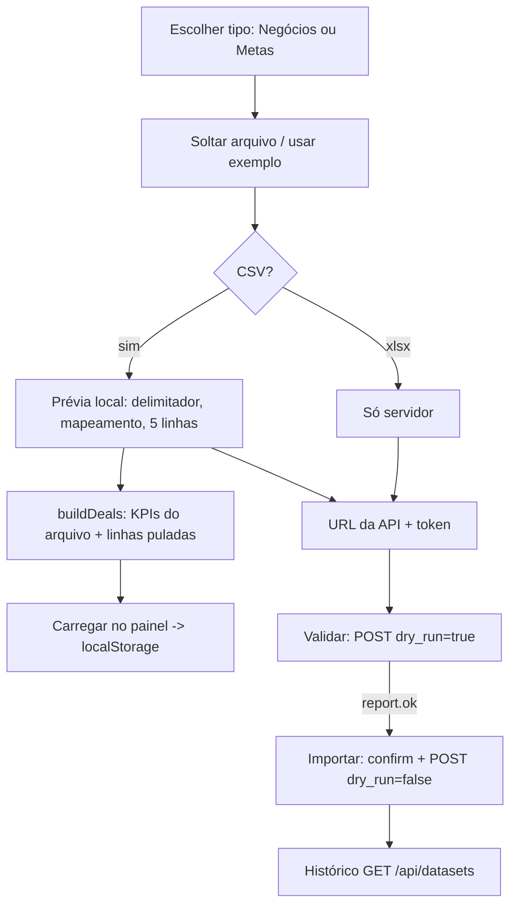

# OmniData — Especificação técnica do frontend

Estado descrito: `web/` na `main` em `321b02d` (26/09/2026). Derivada do código. Complementa
[SPEC-BACKEND.md](SPEC-BACKEND.md) (backend); lá estão o modelo de dados, a API e as regras do bot.
Para montar para outro cliente: [REPLICACAO.md](REPLICACAO.md).

---

## 1. Visão geral

Aplicação Next.js em `web/` com duas partes:

- **Site público**: landing (`/`), funcionalidades, preços, login e cadastro.
- **Painel** (`/dashboard/*`): visão do gestor sobre o pipeline, alertas, insights, reunião de vendas, cockpit das
  conversas do WhatsApp, equipe de agentes, upload de datasets e qualidade dos dados.

Demo pública: https://omnidata-web-eta.vercel.app (dados sintéticos).

### 1.1 O fato mais importante para quem for reaproveitar

**O painel não lê dados de leitura do backend.** KPIs, negócios, alertas, insights, qualidade e reunião de vendas são
calculados **no navegador**, por portes TypeScript dos motores Python, sobre uma de duas fontes:

1. **Dados de exemplo** (`lib/seed.ts`): 24 negócios sintéticos, 4 vendedores.
2. **Arquivo do usuário**: um CSV de negócios carregado em Datasets, validado no navegador e guardado **só** no
   `localStorage` daquele navegador. Nada vai para servidor.

A API do backend só é chamada em duas telas, e só quando o usuário informa a URL e o token de admin:
- **Datasets**: validar/importar o arquivo no Postgres e listar o histórico de uploads.
- **Cockpit de Vendas**: ler as conversas reais do WhatsApp.

Não existe hoje endpoint de leitura para as views `serving.*` (KPIs, saúde dos negócios, forecast...). Ligar o painel
ao banco real é trabalho novo (ver §13).

### 1.2 Autenticação

**Não há autenticação real.** `/login` e `/cadastro` usam `AuthForm`, que espera 1,8 s e redireciona para
`/dashboard` sem enviar nada. O painel mostra "Gestor Demo". O único segredo que o front manipula é o
`ADMIN_API_TOKEN`, digitado pelo usuário nas telas de Datasets e Cockpit e mantido **só em estado React** (nunca em
`localStorage`, cookie ou URL).

---

## 2. Stack

| Item | Escolha |
|---|---|
| Framework | Next.js `^15.5` (App Router), React `^19` |
| Linguagem | TypeScript `^5.6`, `strict: true`, alias `@/*` → `src/*` |
| Dependências de runtime | só `next`, `react`, `react-dom` |
| CSS | um arquivo global (`src/app/globals.css`, ~430 linhas), classes utilitárias próprias; sem Tailwind, sem CSS-in-JS |
| Gráficos | SVG/HTML à mão (`components/charts.tsx`); sem biblioteca |
| Estado | `useState`/`useMemo`; um store externo mínimo sobre `localStorage` (`useSyncExternalStore`) |
| Fontes | `next/font/google`: Inter Tight (display), Instrument Serif itálico (voz), IBM Plex Mono (instrumento) |
| Idioma | pt-BR (`<html lang="pt-BR">`), números e moeda em `Intl` pt-BR |

Scripts (`package.json`): `dev`, `build`, `start`, `typecheck` (`tsc --noEmit`). Não há ESLint nem testes de UI.

---

## 3. Rotas

| Rota | Arquivo | Render | Fonte de dados | Conteúdo |
|---|---|---|---|---|
| `/` | `app/page.tsx` | servidor + ilhas cliente | `seed.ts` (`computeMetrics`) | landing: hero com texto "decrypt", sintomas antes/depois, filme de 5 cenas, equipe, um dia com o Observatório, 4 passos animados, segurança, CTA |
| `/funcionalidades` | `app/funcionalidades/page.tsx` | servidor | estático | lista de funcionalidades por tema, cada uma com exemplo de chat |
| `/precos` | `app/precos/page.tsx` | servidor | estático | 3 planos "sob consulta" |
| `/login`, `/cadastro` | `app/login`, `app/cadastro` | servidor + `AuthForm` | — | formulário de demonstração |
| `/dashboard` | `DashViews.OverviewView` | cliente | seed ou arquivo | ledger do time (meta, ganho, win rate, atingimento, gap, cobertura, parados, perdas sem motivo), alertas de baixa amostra, 5 negócios que pedem atenção |
| `/dashboard/negocios` | `DashViews.NegociosView` | cliente | seed ou arquivo | até 200 negócios abertos por `attention_score` |
| `/dashboard/alertas` | `app/dashboard/alertas/page.tsx` | servidor | estático | as 5 regras de alerta, condição, `dedupe_key` e orçamento (espelha `alerts/engine.py`) |
| `/dashboard/insights` | `InsightsView` | cliente | **só arquivo** | cobertura, dores, termos, demanda, sistemas/ERPs, segmentos, campanhas, motivos de perda |
| `/dashboard/reuniao` | `ReuniaoView` | cliente | **só arquivo** | pauta da reunião de vendas em 6 seções + decisões sugeridas; imprimível em A4 |
| `/dashboard/cockpit` | `Cockpit` | cliente | **API** | conversas reais dos vendedores |
| `/dashboard/equipe` | `TeamGrid` | cliente | `team.json` | os 10 agentes, papel, exemplo e ferramentas |
| `/dashboard/datasets` | `DatasetUploader` | cliente | navegador + **API** | upload, prévia, carregar no painel, validar/importar no servidor, histórico, tabela de conectores |
| `/dashboard/qualidade` | `DashViews.QualidadeView` | cliente | seed ou arquivo | go/no-go por caso de uso + fila de correção da Polaris |

Layout do painel (`app/dashboard/layout.tsx`): barra lateral com logo, `DashNav` (item atual com
`aria-current="page"`) e "Gestor Demo · Sair". Metadados: título `"%s · Dashboard · OmniData"`.

Todas as telas que dependem de dados mostram o `SourceBanner`: "Dados de exemplo" ou "Seu arquivo" (com nome,
contagem e o botão "voltar aos dados de exemplo").

---

## 4. Componentes

| Componente | Papel |
|---|---|
| `Ledger.tsx` | primitivos do design system: `Eyebrow`, `Bar` (tone `clay`/`mint`/`dim`), `Fig`, `Measured` (callout mint), `Flag` (callout clay) |
| `DashViews.tsx` | `SourceBanner`, `OverviewView`, `NegociosView`, `QualidadeView`, `FixQueuePanel` |
| `InsightsView.tsx` | tela de insights (tabelas com minibarras) |
| `ReuniaoView.tsx` | reunião de vendas: seções numeradas, `ForecastSection` (meta e realizado digitados pelo usuário), decisões, impressão |
| `charts.tsx` | `HBars` (barras horizontais relativas ao maior valor, número escrito ao lado) e barra dividida completo/lacuna |
| `DatasetUploader.tsx` | todo o fluxo de upload (§7) |
| `Cockpit.tsx` | lista de vendedores + thread; interpreta `*negrito*` do WhatsApp |
| `Chat.tsx` | balões de conversa (usado no cockpit e nos exemplos do site) |
| `TeamGrid.tsx`, `AgentTag.tsx` | equipe e "selo" do agente responsável por cada bloco, com link para `/dashboard/equipe` |
| `DashNav.tsx`, `SiteChrome.tsx` | navegação do painel; cabeçalho e rodapé do site |
| `AuthForm.tsx` | formulário de demonstração |
| `Logo.tsx` | marca (quadrado + anel + órbita), mesma geometria do favicon; `--logo-ring` para fundo escuro |
| `SpinVerb.tsx` | spinner com verbo rotativo ("Sincronizando", "Auditando"...) |
| `DecryptText.tsx` | texto que "decifra" caractere a caractere; texto real sempre disponível para leitor de tela |
| `StoryFilm.tsx` | filme de 5 cenas da landing, animado em CSS, com play/pausa e segmentos |
| `WorkflowDemo.tsx` | os 4 passos "do CRM ao WhatsApp", com um negócio de exemplo passando pelas etapas |
| `Symptoms.tsx`, `DayTimeline.tsx`, `FeatureList.tsx` | blocos da landing e de funcionalidades |

`app/*/icon.svg` define o favicon por seção.

---

## 5. Bibliotecas (`src/lib/`)

| Arquivo | Conteúdo | Espelha no backend |
|---|---|---|
| `api.ts` | `API_URL` = `NEXT_PUBLIC_API_URL` sem barra final | — |
| `seed.ts` | tipo `Deal`, `STAGE_PROB`, `STAGE_P75`, `MIN_N_RANKING` = 20, 4 donos com meta de R$ 100 mil, 24 negócios | `ingest/seed.py` (versão reduzida) |
| `metrics.ts` | `brl`, `pct`, `wilson`, `health` (flags e `attention`), `computeMetricsFor(deals, ctx)` | `gold.deal_health`, `gold.rep_period_metrics` |
| `upload-store.ts` | store do arquivo do usuário em `localStorage` (chave `omnidata:upload:deals:v1`), `useStored`, `useDashboardData` | — |
| `datasets.ts` | `KINDS` (de `dataset-spec.json`), `norm`, `parseCsv`, `mapHeaders`, `parseAmount`, `parseDate`, `classifyStage`, `stageRank`, `buildDeals`; tipos do relatório do servidor | `datasets/spec.py`, `validate.py`, `coerce.py` |
| `insights.ts` | `painsOf`, `systemsOf`, `demandType`, `classifyLoss`, `terms`, `analyze` | `insights/compute.py` |
| `hygiene.ts` | `nameOk`, `fixQueue` | `hygiene/compute.py` |
| `forecast.ts` | `mulberry32`, `forecast` (arquivo autônomo, sem imports) | `forecast/compute.py` (bit a bit) |
| `decisions.ts` | `decide()` e `LIMITS`: decisões sugeridas por regra fixa | — (só front) |
| `cockpit.ts` | `fetchConversations`, `fetchMessages`, tipos | `api/cockpit.py` |
| `team.ts` | `TEAM` a partir de `team.json` | `agents/team.py` |
| `useReveal.ts` | marca um container como visível uma vez (IntersectionObserver) para animação em cascata | — |

### 5.1 JSON gerados pelo backend (nunca editar à mão)

| Arquivo | Gerar com | Teste de sincronia |
|---|---|---|
| `team.json` | `omnidata team export > web/src/lib/team.json` | `tests/unit/test_agents.py` |
| `dataset-spec.json` | `omnidata dataset spec > web/src/lib/dataset-spec.json` | `tests/datasets/test_datasets.py` |
| `insights-spec.json` | `omnidata insights spec > web/src/lib/insights-spec.json` | `tests/insights/test_insights.py` |
| `hygiene-spec.json` | `omnidata hygiene spec > web/src/lib/hygiene-spec.json` | **nenhum** (lacuna) |

`forecast.ts` é executado no Node por `tests/forecast/test_forecast.py` e comparado com o Python (pula se não houver
`node`). Os portes `insights.ts`, `hygiene.ts` e `datasets.ts` não têm teste de paridade de lógica, só de spec.

---

## 6. Cálculos no navegador

### 6.1 Métricas do time (`metrics.ts`)

`statusOf` deduz aberto/ganho/perdido do campo `status` ou do nome da etapa. `computeMetricsFor` devolve: ganhos,
perdidos, abertos, fechados, valor ganho, meta, gap, valor em aberto, win rate e IC de Wilson 95%, atingimento,
cobertura, cobertura necessária (1 / win rate), `lowN` (< 20 fechados), negócios ordenados por `attention`, parados,
sem próximo passo, perdas sem motivo, cobertura de motivo de perda e número de donos.

`health()` é a versão simplificada de `gold.deal_health`: parado se `daysInStage > p75` da etapa (14 se desconhecida),
flags de data vencida, sem próximo passo e silêncio ≥ 10 dias, e
`attention = valor × prob(etapa) × min(1, 0,25 + 0,3·parado + 0,25·vencido + 0,2·sem próximo passo)`.
**Diferenças para o backend:** não calcula `amount_swing`; `p75` vem de uma tabela fixa no seed; para arquivo enviado
não há datas de etapa, então "parado" não é calculado (`hasTiming = false`) e as probabilidades por etapa são
interpoladas pela ordem das etapas (0,1 a 0,9).

### 6.2 Arquivo do usuário (`datasets.ts::buildDeals`)

1. `parseCsv`: detecta o delimitador (`, ; tab |`) pela primeira linha, trata aspas e BOM.
2. `mapHeaders`: cabeçalhos → colunas canônicas pelos aliases de `dataset-spec.json` (sem acento, sem caixa).
3. Por linha: `id`, `name` e `stage` obrigatórios; `id` repetido rejeitado; valor em formato BR ou US; data
   `AAAA-MM-DD` ou `DD/MM/AAAA`; status pelo campo ou pela etapa ("fechado ganho", "perdido"...); negócio fechado
   exige data de fechamento; motivo de perda também é lido de uma nota "Motivo da perda: X".
4. Até 200 erros listados por linha e coluna; linhas com erro são puladas.
5. Saída: `deals` (para métricas), `records` (com notas, para insights e higiene), `probs` e `stageOrder`.

`.xlsx` não é lido no navegador: só pelo servidor. Limite no navegador: 10 MB.

### 6.3 Decisões da reunião (`decisions.ts`)

Regras fixas sobre números medidos; cada decisão traz regra, evidência, ação sugerida, agente responsável e,
quando cabe, uma ressalva. Limites em `LIMITS`:

| Decisão | Dispara quando |
|---|---|
| `concentration` | um negócio tem ≥ 40% do valor em aberto |
| `value_gap` | ≥ 30% dos abertos sem valor |
| `demand_focus` | uma demanda tem ≥ 20% dos negócios com demanda |
| `erp_focus` | um ERP aparece em ≥ 5 negócios |
| `loss_reason` | ≥ 5 perdidos e < 80% com motivo |
| `pains_coverage` / `top_pain` | < 30% com dor registrada / senão, a dor mais citada (se ≥ 20 negócios com dor) |
| `close_date_past`, `no_next_step` | lacuna na fila de higiene; se ≥ 90% dos abertos, trata como sistêmica (conferir export antes de cobrar) |
| `manager_cleanup` | dono desativado ou nome duplicado |

A tela rotula tudo como **sugestão**, separado do que é medido.

---

## 7. Fluxos

### 7.1 Datasets (`DatasetUploader`)



- "Importar" só habilita depois de uma validação sem erros **do mesmo arquivo com as mesmas opções** (a chave junta
  nome, tamanho, data de modificação, tipo e opções).
- Opções enviadas: `allow_partial`, `replace` (apaga importações anteriores por upload; a confirmação avisa),
  `import_notes`, `stage_order`.
- Erros tratados: 401 token inválido, 503 upload desativado, `code` do servidor, falha de rede/CORS.
- Modelos CSV em `public/templates/`; exemplo real anonimizado em `public/samples/` (63 linhas).
- Metas só entram pelo servidor; no modo navegador só negócios alimentam o painel.

### 7.2 Cockpit

URL da API + token → `GET /api/cockpit/conversations` → clicar num vendedor → `GET .../{user_id}/messages`. Mostra
número de conversas, vendedores ativos e mensagens sem prévia salva; mensagens do vendedor à direita, com `*negrito*`
renderizado e falhas indicadas ("— falhou: <erro>").

### 7.3 Reunião de vendas

Seções: 01 Pipeline (quanto e onde), 02 Demanda, 03 ERPs, 04 Dores e termos, 05 Qualidade, 06 Previsão (o usuário
digita meta e realizado; cenários conservador/central/otimista com faixa p10–p90 e chance de bater a meta), e "O que o
time precisa decidir" (5 decisões visíveis, as demais recolhidas). Botão imprimir (`window.print()`); CSS de impressão
A4 esconde a navegação, ajusta tipografia e evita quebra no meio de blocos.

---

## 8. Design system (Ledger)

Regra central: **um número medido e um número estimado nunca podem parecer iguais.**

### 8.1 Tokens (`globals.css`, `:root`)

| Token | Claro | Uso |
|---|---|---|
| `--paper`, `--paper-deep`, `--rule` | `#f2efe8`, `#e7e3da`, `#d6d2c8` | fundo, fundo secundário, filetes |
| `--ink`, `--ink-soft`, `--ink-faint` | `#11110f`, `#55524b`, `#9c988e` | texto |
| `--clay`, `--clay-deep` | `#ed6738`, `#c8481c` | **reservado**: não verificado, lacuna |
| `--mint` | `#4f9c6b` | **reservado**: medido/verificado |
| `--ledger-bg`, `--ledger-ink`, `--ledger-dim`, `--ledger-rule`, `--ledger-mint` | `#14140f`... | o bloco escuro "ledger" |
| `--display`, `--voice`, `--mono` | Inter Tight, Instrument Serif, IBM Plex Mono | papéis tipográficos |

Tema escuro: os mesmos tokens redefinidos em `@media (prefers-color-scheme: dark)` com
`:root:not([data-theme="light"])` e em `:root[data-theme="dark"]`. Não há seletor de tema na UI.

### 8.2 Regras

1. Clay e mint só com o seu significado. Nunca em botão, hover ou série de gráfico. Botões são tinta (`.btn`,
   `.btn.ghost`).
2. `Measured` (mint) só sobre número calculado, dizendo como reproduzir. `Flag` (clay) para o que não dá para
   afirmar: amostra pequena, perdas sem motivo, lacuna sistêmica.
3. Um bloco `ledger` por tela, no topo.
4. A voz serifada (`.voice`) aparece uma vez por tela, na palavra de julgamento humano.
5. Números em `.mono` com `tabular-nums`.
6. Filetes e contraste de fundo, sem sombras.
7. `eyebrow` com filete marca seção real; números 01/02 só onde há sequência (reunião de vendas).

### 8.3 Classes principais

Layout: `.wrap` (1100 px), `.section`, `.stack`, `.grid2`, `.app`/`.side`/`.main`, `.main-head`, `.panel-t`,
`.tbl-wrap`. Tipografia: `.display`, `.h2`, `.h3`, `.lede`, `.body`, `.note`, `.eyebrow`, `.mono`, `.voice`.
Dados: `.ledger`, `.bar-row`, `.figs`/`.fig`, `.measured`, `.flag`, `.rule-note`, `.tag`/`.tag.gap`, `.minibar`,
`.hbars`, `.decision`, `.rings`. Formulários: `.field`, `.chips`/`.chip`, `.dropzone`, `.opts`, `.linkbtn`.
Landing/animação: `.hero`, `.team`/`.member`, `.symptom`, `.seq`, `.fm-*` (filme), `.wf-*` (workflow), `.dx-*`
(decrypt), `.spinverb`.

### 8.4 Responsivo, movimento e acessibilidade

- Quebras: 1000 px (`.grid2` vira uma coluna), 900 px (hero, planos, login, equipe em 2 colunas), 800 px (menu do
  site some, sequência em 2 colunas), 700/560/500 px (colunas únicas).
- Animações em CSS; conteúdo já visível no estado inicial. `prefers-reduced-motion` desliga as animações e faz o
  `useReveal` e o `DecryptText` resolverem na hora.
- Foco visível (`:focus-visible` com contorno de 2 px), `aria-label` em navegações e áreas interativas,
  `aria-current` no item ativo, `aria-pressed` nos chips, dropzone operável por teclado (Enter/Espaço), textos
  animados com versão real para leitor de tela.

---

## 9. Segurança

`next.config.mjs` aplica em todas as rotas:

| Cabeçalho | Valor |
|---|---|
| `Content-Security-Policy` (só produção) | `default-src 'self'`; scripts/estilos `'self' 'unsafe-inline'`; imagens `'self' data: blob:`; fontes `'self' data:`; `connect-src 'self' https: http://localhost:* http://127.0.0.1:*` (a API pode estar em qualquer HTTPS; HTTP só local, para o token nunca sair em texto puro); `object-src 'none'`; `frame-ancestors 'none'` |
| `X-Frame-Options` | `DENY` |
| `X-Content-Type-Options` | `nosniff` |
| `Referrer-Policy` | `strict-origin-when-cross-origin` |
| `Permissions-Policy` | câmera, microfone, geolocalização, pagamento e USB desligados |
| HSTS | não definido aqui de propósito: a Vercel já envia um valor mais forte |

Também: `poweredByHeader: false`, `reactStrictMode`. O token de admin fica só em memória; dados do usuário ficam só no
`localStorage`; nenhum analytics ou script de terceiros. Melhoria pendente: CSP com nonce (exige middleware) para
remover `'unsafe-inline'`.

---

## 10. Configuração

| Variável | Uso |
|---|---|
| `NEXT_PUBLIC_API_URL` | URL padrão da API nas telas Datasets e Cockpit. Vazia = "modo demonstração" (o usuário pode digitar a URL). |
| `NEXT_DIST_DIR` | pasta de build alternativa, para um build de teste em paralelo ao `npm run dev` |
| `NEXT_TSCONFIG` | tsconfig alternativo nesse caso (`tsconfig.iso.json` = `{ "extends": "./tsconfig.json" }`, ignorado pelo git) |

`outputFileTracingRoot` é fixado na pasta `web/` para o Next não escolher um lockfile de fora do projeto.

---

## 11. Desenvolvimento e deploy

```bash
cd web && npm install && npm run dev
```

- Verificação: `npm run typecheck` e `npm run build`. Build paralelo sem tocar o `.next` do dev:
  `NEXT_DIST_DIR=.next-x NEXT_TSCONFIG=tsconfig.iso.json npm run build`.
- Deploy: Vercel, **Root Directory = `web`** (ADR 0001).
- Para usar Datasets/Cockpit contra a API: o backend precisa listar a origem do site em `CORS_ORIGINS` e ter
  `ADMIN_API_TOKEN` configurado.
- Depois de mudar agentes, specs de dataset, insights ou higiene no backend, regenerar os JSON (§5.1) no mesmo commit.

---

## 12. Testes e verificação

- Não há testes de componente, E2E nem lint no `web/`. A verificação é `typecheck` + `build` + uso no navegador.
- Do lado Python: sincronia de `team.json`, `dataset-spec.json` e `insights-spec.json`, e execução do `forecast.ts` no
  Node comparada com o Python.
- Lacunas: `hygiene-spec.json` sem teste de sincronia; lógica de `insights.ts`, `hygiene.ts` e `datasets.ts` sem teste
  de paridade com o Python.

---

## 13. Guia para reaproveitar em outra branch

1. **Painel com dados reais.** Hoje não há API de leitura. Caminho sugerido, sem quebrar as garantias do backend:
   - criar rotas `GET` no backend sobre as views `serving.*` (ex. KPIs por período, `v_deal_health`, fila de
     higiene, forecast), com escopo por `Principal` e autenticação que não seja o token de admin compartilhado;
   - trocar `useDashboardData()` por um hook que busque esses dados e devolva o mesmo formato de `Metrics`; as telas
     não precisam mudar, porque todas consomem `useDashboardData()`/`useStored()`;
   - manter o modo "arquivo no navegador" como alternativa sem servidor.
2. **Autenticação real.** Substituir `AuthForm` e o "Gestor Demo" por login de verdade (ex. Supabase Auth, já que o
   banco é Supabase) e mapear o usuário web para `app.app_user`/`Principal` no backend. O token de admin digitado à mão
   deve sair do fluxo do gestor.
3. **Manter os portes em paridade.** Qualquer mudança em `insights/`, `hygiene/`, `forecast/` ou `datasets/` no Python
   exige atualizar o porte TS e regenerar o JSON correspondente.
4. **Design system.** Novas telas usam os primitivos de `Ledger.tsx` e respeitam §8.2; clay/mint continuam
   reservados.
5. **Conteúdo sintético.** `seed.ts` e os números da landing são exemplo; nunca apresentar como dado do cliente.

---

## 14. Limitações conhecidas

- Sem autenticação e sem autorização por usuário no painel.
- Painel não lê o banco; os números do painel e os do bot só coincidem se vierem do mesmo arquivo.
- `health()` do front não calcula `amount_swing` nem "parado" para arquivos enviados.
- `.xlsx` só é lido pelo servidor.
- `localStorage` limita o tamanho do arquivo que dá para carregar no painel e não sincroniza entre navegadores.
- A página de Alertas é estática: descreve as regras, não mostra alertas reais.
- Sem seletor de tema; o tema segue o sistema operacional.
